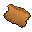
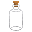
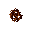
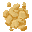
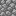
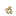

# Recipes & Production

This page exposes every recipe found in the uploaded snapshot.

Each recipe uses a **9×9 display grid**. Normal crafting patterns are centered inside it; machine recipes use the machine block in the middle, inputs on the left, and outputs on the right.

!!! note
    Tag ingredients such as **Any Planks** and **Any Stone** are shown with one representative vanilla texture in the grid.

## Crafting recipes

### Advanced Furnace

×1

- **Recipe file:** `advanced_furnace.json`
- **Type:** `minecraft:crafting_shaped`
- **Inputs:** Glass Bottle ×4; Iron Ingot ×4; Furnace
- **Outputs:** Advanced Furnace

### Bang

×1

- **Recipe file:** `bang.json`
- **Type:** `minecraft:crafting_shaped`
- **Inputs:** Glass ×4
- **Outputs:** Bang

### Cardboard Piece

×1

- **Recipe file:** `cupboard_piece.json`
- **Type:** `minecraft:crafting_shaped`
- **Inputs:** Sugar Cane ×4
- **Outputs:** Cardboard Piece

### Dryer

×1

- **Recipe file:** `dryer.json`
- **Type:** `minecraft:crafting_shaped`
- **Inputs:** Any Planks ×5; Any Stone
- **Outputs:** Dryer
- **Note:** Tag ingredients are shown with one representative texture.

### Filter

×4

- **Recipe file:** `filter.json`
- **Type:** `minecraft:crafting_shaped`
- **Inputs:** Cardboard Piece
- **Outputs:** Filter ×4

### Filter (fluid_filter)

×1

- **Recipe file:** `fluid_filter.json`
- **Type:** `minecraft:crafting_shaped`
- **Inputs:** String ×4; Paper ×4; Coal / Charcoal
- **Outputs:** Filter
- **Note:** This recipe accepts an alternative ingredient in one slot.

### Glass Bottle

×1

- **Recipe file:** `glass_bottle.json`
- **Type:** `minecraft:crafting_shaped`
- **Inputs:** Glass Bottle
- **Outputs:** Glass Bottle

### Mortar

×1

- **Recipe file:** `grinding_bowl.json`
- **Type:** `minecraft:crafting_shaped`
- **Inputs:** Brick ×5
- **Outputs:** Mortar

### Pestle

×1

- **Recipe file:** `grinding_tool.json`
- **Type:** `minecraft:crafting_shaped`
- **Inputs:** Stick; Stone
- **Outputs:** Pestle

### Piece of Hash

×16

- **Recipe file:** `hash_piece.json`
- **Type:** `minecraft:crafting_shaped`
- **Inputs:** Hash Brick
- **Outputs:** Piece of Hash ×16

### Headphones

×1

- **Recipe file:** `headphones.json`
- **Type:** `minecraft:crafting_shaped`
- **Inputs:** Iron Ingot ×2; String ×2; Jukebox
- **Outputs:** Headphones

### Mixing Vat

×1

- **Recipe file:** `mixing_vat.json`
- **Type:** `minecraft:crafting_shaped`
- **Inputs:** Iron Ingot ×7; Stick
- **Outputs:** Mixing Vat

### Personal Diary

×1

- **Recipe file:** `personal_diary.json`
- **Type:** `minecraft:crafting_shaped`
- **Inputs:** Book
- **Outputs:** Personal Diary

### Rolling Gadget

×1

- **Recipe file:** `roller.json`
- **Type:** `minecraft:crafting_shaped`
- **Inputs:** Coal; Paper; Iron Ingot
- **Outputs:** Rolling Gadget

### Sieve

×1

- **Recipe file:** `sieve.json`
- **Type:** `minecraft:crafting_shaped`
- **Inputs:** String ×3; Paper ×2; Leather; Any Planks ×3
- **Outputs:** Sieve
- **Note:** Tag ingredients are shown with one representative texture.

## Mortar recipes

### Cocaine Dust

×6

- **Recipe file:** `grinding/cocaine.json`
- **Machine:** `grinding`
- **Inputs:** Cocaine Plate
- **Outputs:** Cocaine Dust ×6

### Crack Shard

×3

- **Recipe file:** `grinding/crack.json`
- **Machine:** `grinding`
- **Inputs:** Crack Plate
- **Outputs:** Crack Shard ×3

### Cannabis Powder

×2

- **Recipe file:** `grinding/dried_cannabis_leaf.json`
- **Machine:** `grinding`
- **Inputs:** Dried Cannabis Leaf
- **Outputs:** Cannabis Powder ×2

### Coca Paste

- **Recipe file:** `grinding/dried_coca_leaf.json`
- **Machine:** `grinding`
- **Inputs:** Dried Coca Leaf
- **Outputs:** Coca Paste

### Magic Mushroom Powder

×2

- **Recipe file:** `grinding/magic_mushroom.json`
- **Machine:** `grinding`
- **Inputs:** Magic Mushroom
- **Outputs:** Magic Mushroom Powder ×2

### Malt Powder

×2

- **Recipe file:** `grinding/malt.json`
- **Machine:** `grinding`
- **Inputs:** Malt
- **Outputs:** Malt Powder ×2

### Meth Powder

×2

- **Recipe file:** `grinding/meth_shard.json`
- **Machine:** `grinding`
- **Inputs:** Meth Shard
- **Outputs:** Meth Powder ×2

### Plant Biomass

- **Recipe file:** `grinding/plant_biomass.json`
- **Machine:** `grinding`
- **Inputs:** Wheat Seeds
- **Outputs:** Plant Biomass

### Handful of Tobacco

×2

- **Recipe file:** `grinding/tobacco.json`
- **Machine:** `grinding`
- **Inputs:** Dried Tobacco Leaf
- **Outputs:** Handful of Tobacco ×2

### Flour

×2

- **Recipe file:** `grinding/wheat.json`
- **Machine:** `grinding`
- **Inputs:** Wheat
- **Outputs:** Flour ×2

## Dryer recipes

### Dried Coca Leaf

- **Recipe file:** `drying/coca_leaf.json`
- **Machine:** `drying`
- **Inputs:** Coca Leaf
- **Outputs:** Dried Coca Leaf

### Cured Cannabis Leaf

- **Recipe file:** `drying/cured_cannabis_leaf.json`
- **Machine:** `drying`
- **Inputs:** Cannabis Leaf
- **Outputs:** Cured Cannabis Leaf

### Dried Kelp

- **Recipe file:** `drying/dried_kelp_from_kelp.json`
- **Machine:** `drying`
- **Inputs:** Kelp
- **Outputs:** Dried Kelp

### Dried Tobacco Leaf

- **Recipe file:** `drying/tobacco_leaf.json`
- **Machine:** `drying`
- **Inputs:** Tobacco Leaf
- **Outputs:** Dried Tobacco Leaf

## Sieve recipes

### Dried Cannabis Leaf

- **Recipe file:** `sieving/cannabis_resin.json`
- **Machine:** `sieving`
- **Inputs:** Cured Cannabis Leaf
- **Outputs:** Dried Cannabis Leaf; Cannabis Resin

### Flint

- **Recipe file:** `sieving/flint_from_gravel_sieving.json`
- **Machine:** `sieving`
- **Inputs:** Gravel
- **Outputs:** Flint; Iron Nugget

## Stomp Crafter recipes

### Hash Brick

×10

- **Recipe file:** `stomp_crafting/hash_brick.json`
- **Machine:** `stomp_crafting`
- **Inputs:** Cannabis Resin ×10
- **Outputs:** Hash Brick

## Advanced Furnace recipes

### Coal Tar

- **Recipe file:** `advanced_furnace/coal_tar.json`
- **Machine:** `advanced_furnace`
- **Inputs:** Coal
- **Outputs:** Cobblestone; Coal Tar

### Starch Mash

- **Recipe file:** `advanced_furnace/starch_mash.json`
- **Machine:** `advanced_furnace`
- **Inputs:** Potato
- **Outputs:** Baked Potato; Starch Mash

## Mixing Vat recipes

### Activated Lysergic Acid

100 mB

150 mB

50 mB

- **Recipe file:** `mixing_vat/activated_lysergic_acid.json`
- **Machine:** `mixing_vat`
- **Inputs:** Lysergic Acid 100 mB; Acylating Agent 50 mB
- **Outputs:** Activated Lysergic Acid 150 mB
- **Details:** Required stirs: 3

### Acylating Agent

100 mB

200 mB

100 mB

- **Recipe file:** `mixing_vat/acylating_agent.json`
- **Machine:** `mixing_vat`
- **Inputs:** Sulfur Compound 100 mB; Hydrochloric Acid 100 mB
- **Outputs:** Acylating Agent 200 mB
- **Details:** Required stirs: 3

### Amino Acid

200 mB

150 mB

- **Recipe file:** `mixing_vat/amino_acid.json`
- **Machine:** `mixing_vat`
- **Inputs:** Plant Biomass; Malt; Water 150 mB
- **Outputs:** Amino Acid 200 mB
- **Details:** Required stirs: 3

### Diethylamine

500 mB

800 mB

300 mB

- **Recipe file:** `mixing_vat/diethylamine.json`
- **Machine:** `mixing_vat`
- **Inputs:** Raw Alcohol 500 mB; Ammoniac 300 mB
- **Outputs:** Diethylamine 800 mB
- **Details:** Required stirs: 3

### Fermented Mash

100 mB

200 mB

100 mB

- **Recipe file:** `mixing_vat/fermented_mash.json`
- **Machine:** `mixing_vat`
- **Inputs:** Sweet Mash 100 mB; Wild Yeast 100 mB
- **Outputs:** Fermented Mash 200 mB
- **Details:** Required stirs: 6

### Lsd

1000 mB

1500 mB

500 mB

- **Recipe file:** `mixing_vat/lsd.json`
- **Machine:** `mixing_vat`
- **Inputs:** Activated Lysergic Acid 1000 mB; Diethylamine 500 mB
- **Outputs:** Lsd 1500 mB
- **Details:** Required stirs: 3

### Murky Extract

150 mB

100 mB

- **Recipe file:** `mixing_vat/murky_extract.json`
- **Machine:** `mixing_vat`
- **Inputs:** Coca Paste; Raw Alcohol 100 mB
- **Outputs:** Murky Extract 150 mB
- **Details:** Required stirs: 3

### Sweet Mash

200 mB

100 mB

- **Recipe file:** `mixing_vat/sweet_mash.json`
- **Machine:** `mixing_vat`
- **Inputs:** Malt Powder; Starch Mash 100 mB
- **Outputs:** Sweet Mash 200 mB
- **Details:** Required stirs: 5

### Wild Yeast

150 mB

100 mB

- **Recipe file:** `mixing_vat/wild_yeast.json`
- **Machine:** `mixing_vat`
- **Inputs:** Flour; Water 100 mB
- **Outputs:** Wild Yeast 150 mB
- **Details:** Required stirs: 3

## Distiller recipes

### Fermented Mash

700 mB

1000 mB

300 mB

- **Recipe file:** `distilling/fermented_mash.json`
- **Machine:** `distiller`
- **Inputs:** Fermented Mash 1000 mB
- **Outputs:** Raw Alcohol 700 mB; Water 300 mB

## Fluid Filterer recipes

### Filtered Extract

1000 mB

850 mB

- **Recipe file:** `fluid_filtering/filtered_extract.json`
- **Machine:** `fluid_filtering`
- **Inputs:** Murky Extract 1000 mB; Filter
- **Outputs:** Filtered Extract 850 mB; Plant Waste
- **Details:** Clicks required: 14; Hunger per tick: 1

## Evaporation Tray recipes

### Crack Plate

1000 mB

- **Recipe file:** `evaporation_tray/crack_plate.json`
- **Machine:** `evaporation_tray`
- **Inputs:** Crack 1000 mB
- **Outputs:** Crack Plate

### Evaporate Water

1000 mB

- **Recipe file:** `evaporation_tray/evaporate_water.json`
- **Machine:** `evaporation_tray`
- **Inputs:** Water 1000 mB
- **Outputs:** Clay Ball

### Filtered Extract

1000 mB

- **Recipe file:** `evaporation_tray/filtered_extract.json`
- **Machine:** `evaporation_tray`
- **Inputs:** Filtered Extract 1000 mB
- **Outputs:** Cocaine Plate

### Tryptophan

1000 mB

×4

- **Recipe file:** `evaporation_tray/tryptophan.json`
- **Machine:** `evaporation_tray`
- **Inputs:** Tryptophan Solution 1000 mB
- **Outputs:** Tryptophan Powder ×4

## Centrifuge recipes

### Tryptophan

50 mB

1000 mB

950 mB

- **Recipe file:** `centrifuge/tryptophan.json`
- **Machine:** `centrifuge`
- **Inputs:** Amino Acid 1000 mB
- **Outputs:** Tryptophan Solution 50 mB; Waste Biomass 950 mB

## Growth Chamber recipes

### Ergot

×4

250 mB

- **Recipe file:** `growth_chamber/ergot.json`
- **Machine:** `growth_chamber`
- **Inputs:** Fungal Rye Culture; Rye Seeds; Water 250 mB
- **Outputs:** Infected Rye; Ergot ×4
- **Details:** Base ticks: 200

### Fungal Culture

250 mB

- **Recipe file:** `growth_chamber/fungal_culture.json`
- **Machine:** `growth_chamber`
- **Inputs:** Ergot; Plant Biomass; Water 250 mB
- **Outputs:** Fungal Fiber; Fungal Rye Culture
- **Details:** Base ticks: 200

## Biochemical Reactor recipes

### Ergotamine

×2

500 mB

- **Recipe file:** `biochemical_reactor/ergotamine.json`
- **Machine:** `biochemical_reactor`
- **Inputs:** Ergot ×2; Tryptophan Powder
- **Outputs:** Ergotamine 500 mB
- **Details:** Minimum heat: 30; Processing time: 520 ticks

## Gasifier recipes

### Chlorine

250

- **Recipe file:** `gasifier/chlorine.json`
- **Machine:** `gasifier`
- **Inputs:** Salt Powder
- **Outputs:** Chlorine 250

### Sulfur Gas

250

- **Recipe file:** `gasifier/sulfur_gas.json`
- **Machine:** `gasifier`
- **Inputs:** Sulfur Powder
- **Outputs:** Sulfur Gas 250

## Chemical Reactor recipes

### Hydrochloric Gas

250

400

250

- **Recipe file:** `chemical_reactor/hydrochloric_gas.json`
- **Machine:** `chemical_reactor`
- **Inputs:** Air 250; Chlorine 250
- **Outputs:** Hydrochloric Gas 400
- **Details:** Minimum heat: 400; Heat drain: 18; Processing time: 180 ticks

### Reactive Gas

250

400

250

- **Recipe file:** `chemical_reactor/reactive_gas.json`
- **Machine:** `chemical_reactor`
- **Inputs:** Air 250; Sulfur Gas 250
- **Outputs:** Sulfur Oxide 400
- **Details:** Minimum heat: 400; Heat drain: 18; Processing time: 180 ticks

## Advanced Mixing Vat recipes

### Chemical Compound

750 mB

1000 mB

250

- **Recipe file:** `advanced_mixing_vat/chemical_compound.json`
- **Machine:** `advanced_mixing_vat`
- **Inputs:** Water 750 mB; Sulfur Oxide 250
- **Outputs:** Sulfur Compound 1000 mB
- **Details:** Processing time: 100 ticks

### Crack

250 mB

550 mB

250 mB

- **Recipe file:** `advanced_mixing_vat/crack.json`
- **Machine:** `advanced_mixing_vat`
- **Inputs:** Water 250 mB; Ammoniac 250 mB
- **Outputs:** Crack 550 mB
- **Details:** Processing time: 100 ticks

### Hydrochloric Acid

750 mB

1000 mB

250

- **Recipe file:** `advanced_mixing_vat/hydrochloric_acid.json`
- **Machine:** `advanced_mixing_vat`
- **Inputs:** Water 750 mB; Hydrochloric Gas 250
- **Outputs:** Hydrochloric Acid 1000 mB
- **Details:** Processing time: 100 ticks

### Lysergic Acid

750 mB

750 mB

1000 mB

750 mB

- **Recipe file:** `advanced_mixing_vat/lysergic_acid.json`
- **Machine:** `advanced_mixing_vat`
- **Inputs:** Ergotamine 750 mB; Hydrochloric Acid 750 mB; Water 750 mB
- **Outputs:** Lysergic Acid 1000 mB
- **Details:** Processing time: 100 ticks
